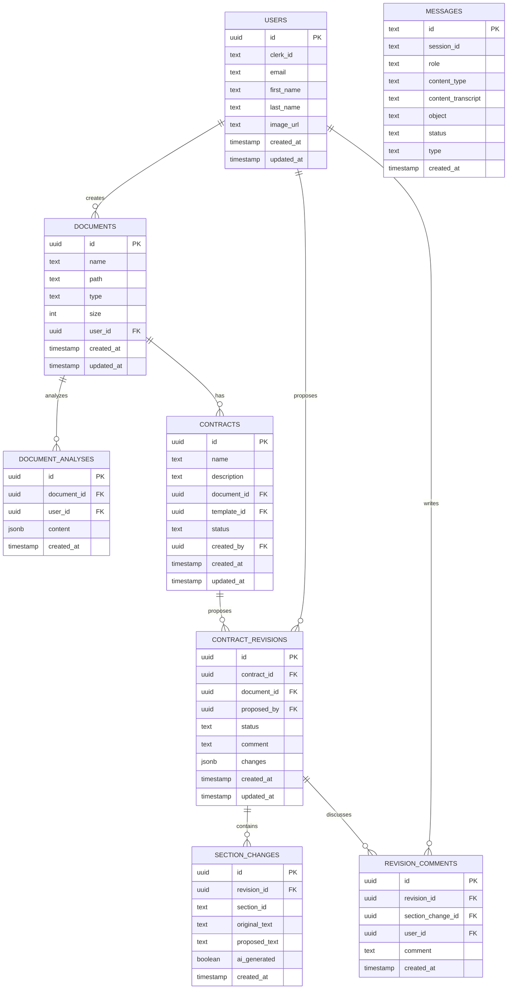
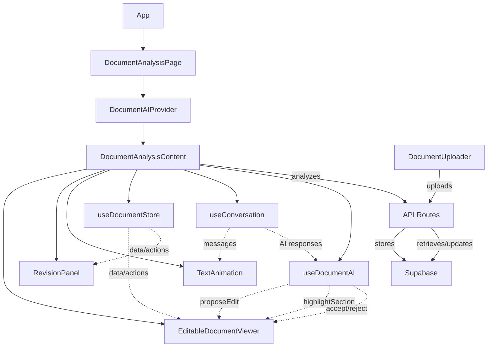

# System Architecture

TrustInk is built with a modern architecture using Next.js, React, Supabase, and AI integration. This document outlines the database structure and component architecture.

## Database Structure

TrustInk uses Supabase as its primary database with PostgreSQL. The schema is designed to support document management, contract processing, and AI-assisted revisions.



### Key Tables

- **users**: Extends Clerk authentication with additional user information
- **documents**: Stores uploaded files with metadata
- **document_analyses**: Stores AI analysis results for documents
- **contracts**: Represents legal contracts linked to documents
- **contract_revisions**: Tracks proposed changes to contracts
- **section_changes**: Stores specific text changes within a revision
- **revision_comments**: Captures discussion on proposed changes
- **messages**: Stores conversation history with the AI

## Component Architecture

The application is built with React components organized in a hierarchy that facilitates document viewing, editing, and AI interaction.



## Key Architectural Components

### Frontend

- **Next.js**: Server-side rendering and API routes
- **React**: Component-based UI
- **Zustand**: State management for document data
- **Context API**: Communication between AI and document components

### Backend

- **Supabase**: Database, authentication (alongside Clerk), and storage
- **API Routes**: Next.js API endpoints for document operations
- **AI Integration**: Interfaces with AI services for document analysis

### Authentication

- **Clerk**: Primary authentication provider
- **Row-Level Security**: Enforced in Supabase for data access control

## Directory Structure

```
src/
├── app/             # Next.js app routes
│   ├── (app)/        # Private routes
│   ├── api/          # API endpoints
│   └── auth/         # Authentication routes
├── components/      # React components
├── hooks/           # Custom React hooks
├── interfaces/      # TypeScript interfaces
├── lib/             # Utility functions, API clients
├── providers/       # Context providers
├── store/           # Zustand store
└── types.ts         # Common TypeScript types
```

## Communication Flow

1. **User Interaction**: User interacts with document or asks AI questions
2. **State Management**: Zustand store manages document state
3. **Context Communication**: DocumentAIProvider facilitates AI-document interaction
4. **API Integration**: API routes handle database operations
5. **Storage**: Document files stored in Supabase storage
6. **Database**: Structured data stored in Supabase PostgreSQL 