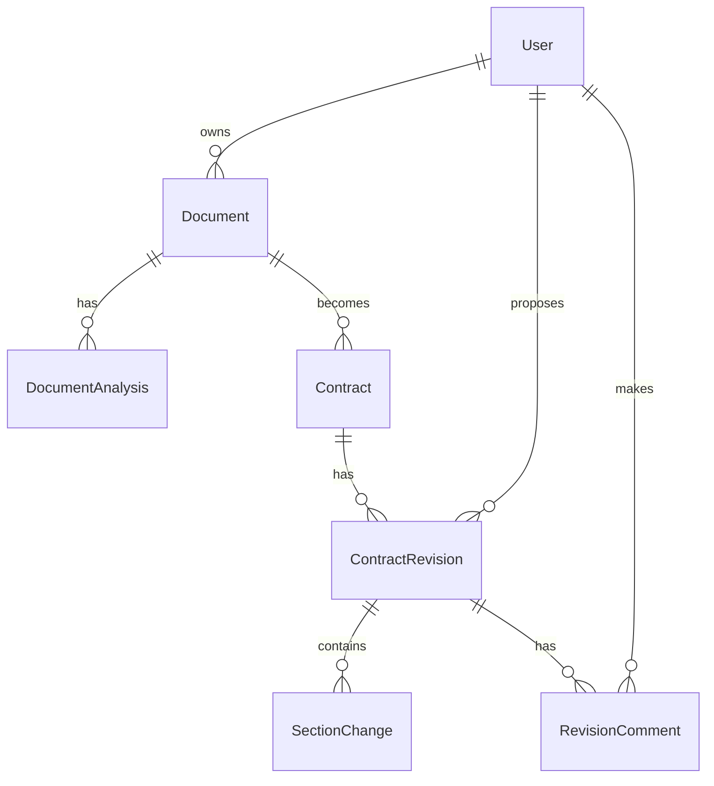

# Data Models

This document outlines the key data structures within TrustInk.

## Core Entities

### User

```typescript
interface User {
  id: string;          // Primary key, from Clerk
  email: string;       // User's email address
  name: string;        // User's full name
  created_at: Date;    // When the user account was created
  updated_at: Date;    // When the user was last updated
}
```

### Document

```typescript
interface Document {
  id: string;          // Primary key, UUID
  name: string;        // Document name (typically filename)
  path: string;        // Storage path in Supabase
  type: string;        // Document MIME type (e.g., application/pdf)
  size: number;        // File size in bytes
  user_id: string;     // Foreign key to User
  created_at: Date;    // When the document was uploaded
  updated_at: Date;    // When the document was last modified
}
```

### DocumentAnalysis

```typescript
interface DocumentAnalysis {
  id: string;          // Primary key, UUID
  document_id: string; // Foreign key to Document
  user_id: string;     // Foreign key to User who requested analysis
  content: object;     // JSON containing analysis results, including sections
  created_at: Date;    // When the analysis was performed
}
```

### Contract

```typescript
interface Contract {
  id: string;          // Primary key, UUID
  name: string;        // Contract name
  document_id: string; // Foreign key to Document
  user_id: string;     // Foreign key to User (owner)
  status: string;      // draft, active, completed, etc.
  created_at: Date;    // When the contract was created
  updated_at: Date;    // When the contract was last updated
}
```

### ContractRevision

```typescript
interface ContractRevision {
  id: string;           // Primary key, UUID
  contract_id: string;  // Foreign key to Contract
  document_id: string;  // Foreign key to Document (current version)
  proposed_by: string;  // Foreign key to User who proposed the revision
  status: string;       // pending, accepted, rejected
  comment: string;      // Optional comment about the revision
  changes: object;      // JSON with metadata about changes
  created_at: Date;     // When the revision was proposed
  updated_at: Date;     // When the revision status was last updated
}
```

### SectionChange

```typescript
interface SectionChange {
  id: string;               // Primary key, UUID
  revision_id: string;      // Foreign key to ContractRevision
  section_id: string;       // ID of the document section being changed
  original_text: string;    // Text before change
  proposed_text: string;    // Text after change
  ai_generated: boolean;    // Whether the change was AI-generated
  created_at: Date;         // When the change was created
}
```

### RevisionComment

```typescript
interface RevisionComment {
  id: string;           // Primary key, UUID
  revision_id: string;  // Foreign key to ContractRevision
  user_id: string;      // Foreign key to User who made the comment
  comment: string;      // Text of the comment
  created_at: Date;     // When the comment was created
}
```

## User-Document Relationship

### Implementation Status

The user-document relationship is fully implemented with:

1. **Database Structure**
   - Documents table includes `user_id` foreign key
   - Row-level security ensures users can only access their documents
   - Clerk integration provides user authentication and identity

2. **API Endpoints**
   - `GET /api/documents` - Retrieves all documents for the current user
   - `GET /api/documents?id=X` - Retrieves a specific document (with user verification)
   - `POST /api/documents` - Creates a new document associated with the current user

3. **Supabase Functions**
   - `getUserDocuments(supabase, userId)` - Gets all documents for a user
   - `getUserDocumentsWithMeta(supabase, userId)` - Gets documents with related metadata
   - `getDocumentById(supabase, documentId, userId)` - Gets a specific document for a user

## Application State Models

### Document Store (Zustand)

```typescript
interface DocumentState {
  currentDocument: {
    id: string;
    name: string;
    file: File;
    pdfBytes: Uint8Array;
    parsedContent: {
      sections: Section[];
    };
  } | null;
  isDocumentLoading: boolean;
  highlightedSection: string | null;
  
  // Actions
  setCurrentDocument: (document: Document) => void;
  setDocumentLoading: (loading: boolean) => void;
  setHighlightedSection: (sectionId: string | null) => void;
  updateDocumentSection: (sectionId: string, newText: string) => void;
}
```

### Section

```typescript
interface Section {
  id: string;
  title?: string;
  text: string;
  pageNumber: number;
  position: {
    x: number;
    y: number;
    width: number;
    height: number;
  };
}
```

## Custom Hook Types

### useDocumentUpload Hook

```typescript
interface UseDocumentUploadResult {
  dragActive: boolean;
  setDragActive: (active: boolean) => void;
  uploadError: string | null;
  lastFile: File | null;
  processFile: (file: File) => Promise<string | null>;
  isProcessing: boolean;
}
```

### useDocumentEditing Hook

```typescript
interface UseDocumentEditingResult {
  sections: EditableSection[];
  highlightedSection: string | null;
  setHighlightedSection: (sectionId: string | null) => void;
  proposeEdit: (sectionId: string, newText: string) => void;
  acceptEdit: (sectionId: string) => void;
  rejectEdit: (sectionId: string) => void;
  startEditing: (sectionId: string) => void;
  saveEdit: (sectionId: string, newText: string) => void;
  cancelEditing: (sectionId: string) => void;
  hasDocument: boolean;
}

interface EditableSection extends Section {
  isEditing?: boolean;
  proposedText?: string;
}
```

## Database Relationships



## Current Implementation

The database layer is fully implemented using Supabase with:

1. Tables for all core entities
2. Row-level security policies
3. Foreign key relationships
4. Indexes for efficient queries

The document fetching API is currently:
- Using standardized functions in `src/lib/supabase.ts`
- Properly handling authorization with Clerk
- Supporting filtering and metadata inclusion
- Returning properly typed results 

## Storage Structure

TrustInk uses Supabase for both database and file storage. Here's how storage is structured:

### Storage Buckets

The application uses three primary storage buckets:

1. **`pdf-documents`**: Primary bucket for original PDF files
   - File naming: `userId_timestamp.pdf`
   - Usage: Preserves original, unmodified documents

2. **`documents`**: General-purpose document storage
   - File naming: `userId_timestamp.fileExtension`
   - Usage: Processed files, thumbnails, exported versions

3. **`voice-recordings`**: Storage for voice interaction recordings
   - File naming: `userId_sessionId_timestamp.webm`
   - Usage: Stores recordings when explicitly enabled by users

### Database Tables

The core application data is stored in several main tables:

#### `documents`

Stores metadata about uploaded files.

| Column       | Type         | Description                                 |
|--------------|--------------|---------------------------------------------|
| id           | UUID         | Primary key                                 |
| user_id      | String       | Owner ID (from Clerk)                       |
| name         | String       | Display name for the document               |
| path         | String       | Storage path in Supabase bucket             |
| type         | String       | MIME type (e.g., "application/pdf")         |
| size         | Number       | File size in bytes                          |
| created_at   | Timestamp    | Creation timestamp                          |
| updated_at   | Timestamp    | Last update timestamp                       |

#### `document_analyses`

Stores extracted content and analysis results for documents.

| Column       | Type         | Description                                 |
|--------------|--------------|---------------------------------------------|
| id           | UUID         | Primary key                                 |
| document_id  | UUID         | Reference to documents.id                   |
| user_id      | String       | Owner ID (from Clerk)                       |
| content      | JSONB        | Analysis results, sections, metadata        |
| created_at   | Timestamp    | Creation timestamp                          |

The `content` field is a structured JSON object containing:
- `pageCount`: Number of pages in the document
- `sections`: Array of extracted document sections
- `analysis`: Results from AI processing
- `extractedAt`: Timestamp when extraction occurred 