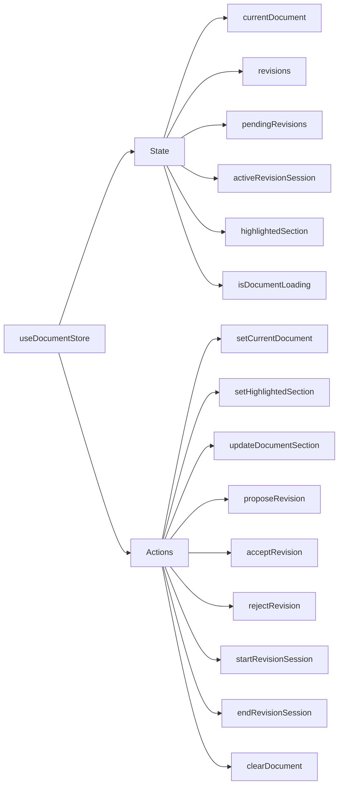
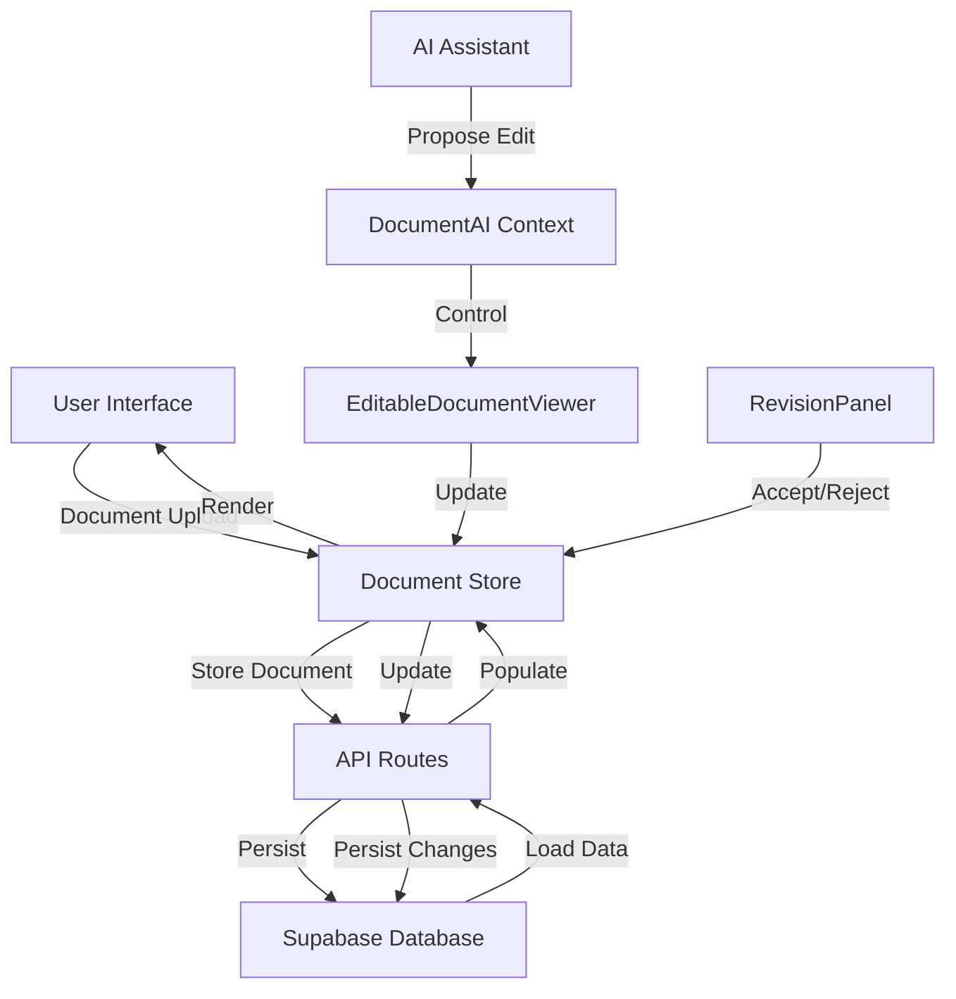

# Data Models

This document outlines the core data types and state management structure in TrustInk. Understanding these models is essential for working with the application's data flow.

## Core Data Types

TrustInk uses TypeScript interfaces to define the structure of its data models. Here are the key data types used across the application:

### Document Types

```typescript
// Document section
interface DocumentSection {
  id: string;
  title?: string;
  text: string;
  pageNumber: number;
  position: { x: number, y: number, width: number, height: number };
}

// Editable version of a document section
interface EditableSection extends DocumentSection {
  isEditing?: boolean;
  proposedText?: string;
}

// Document model
interface Document {
  id?: string;
  name?: string;
  content?: string;
  file?: File;
  pdfBytes?: Uint8Array;
  parsedContent?: {
    sections: DocumentSection[];
  };
  contractId?: string;
  ownerId?: string;
}
```

### Revision Types

```typescript
// Section revision
interface SectionRevision {
  sectionId: string;
  originalText: string;
  proposedText: string;
  status: 'pending' | 'accepted' | 'rejected';
  createdAt: Date;
  createdBy: string;
  aiGenerated?: boolean;
  comment?: string;
}

// Contract revision
interface ContractRevision {
  id?: string;
  contractId: string;
  documentId: string;
  proposedBy: string;
  status: 'pending' | 'accepted' | 'rejected';
  comment?: string;
  changes: SectionRevision[];
  createdAt?: Date;
  updatedAt?: Date;
}
```

### AI Interaction Types

```typescript
// EditableDocumentViewerRef type for AI interaction
interface EditableDocumentViewerRef {
  proposeEditFromAI: (sectionId: string, newText: string) => void;
  highlightSection: (sectionId: string | null) => void;
  getSections: () => EditableSection[];
}

// AI action types
type AIAction = 
  | { type: 'propose_edit'; sectionId: string; text: string }
  | { type: 'highlight'; sectionId: string | null }
  | { type: 'none' };
```

## Zustand Store Structure

TrustInk uses Zustand for state management, particularly for document and revision state. The store structure is designed to provide a clean interface for components to interact with shared state.

### Store Interface

```typescript
interface DocumentStore {
  // State
  currentDocument: Document | null;
  revisions: Record<string, ContractRevision>;
  pendingRevisions: SectionRevision[];
  activeRevisionSession: string | null;
  highlightedSection: string | null;
  isDocumentLoading: boolean;
  
  // Actions
  setCurrentDocument: (document: Document) => void;
  setHighlightedSection: (sectionId: string | null) => void;
  updateDocumentSection: (sectionId: string, newText: string) => void;
  proposeRevision: (
    sectionId: string, 
    newText: string, 
    aiGenerated?: boolean,
    comment?: string
  ) => void;
  acceptRevision: (revisionId: string) => void;
  rejectRevision: (revisionId: string) => void;
  startRevisionSession: (sessionId: string) => void;
  endRevisionSession: () => void;
  clearDocument: () => void;
}
```

### Store Structure Diagram



## DocumentAI Context

The DocumentAI context is a React context that facilitates communication between the AI assistant and document components. It uses a reference to the EditableDocumentViewer to control document interaction.

```typescript
interface DocumentAIContextType {
  proposeEdit: (sectionId: string, newText: string) => void;
  highlightSection: (sectionId: string | null) => void;
  lastAction: AIAction;
  acceptLastEdit: () => void;
  rejectLastEdit: () => void;
  documentViewerRef: MutableRefObject<EditableDocumentViewerRef | null>;
}
```

## Database Models

The database models mirror many of the TypeScript interfaces but are structured for SQL storage. The key tables are defined in the Supabase schema:

- **documents**: Stores document metadata and file paths
- **document_analyses**: Stores AI analysis results
- **contract_revisions**: Tracks proposed contract changes
- **section_changes**: Stores specific text edits within revisions

See [Supabase Schema](./01-system-architecture.md#database-structure) for full database model details.

## Data Flow Between Models



This data flow ensures that user interactions, document changes, and AI suggestions all flow through the centralized document store before being persisted to the database. 