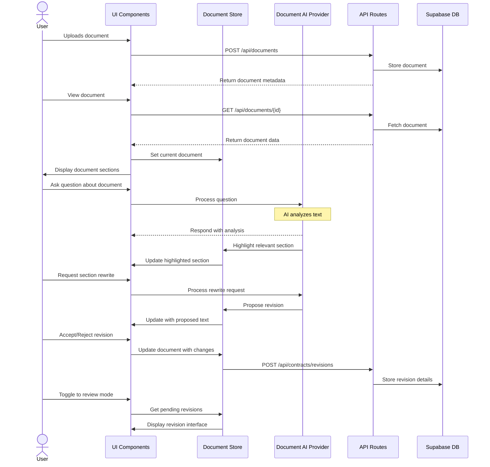
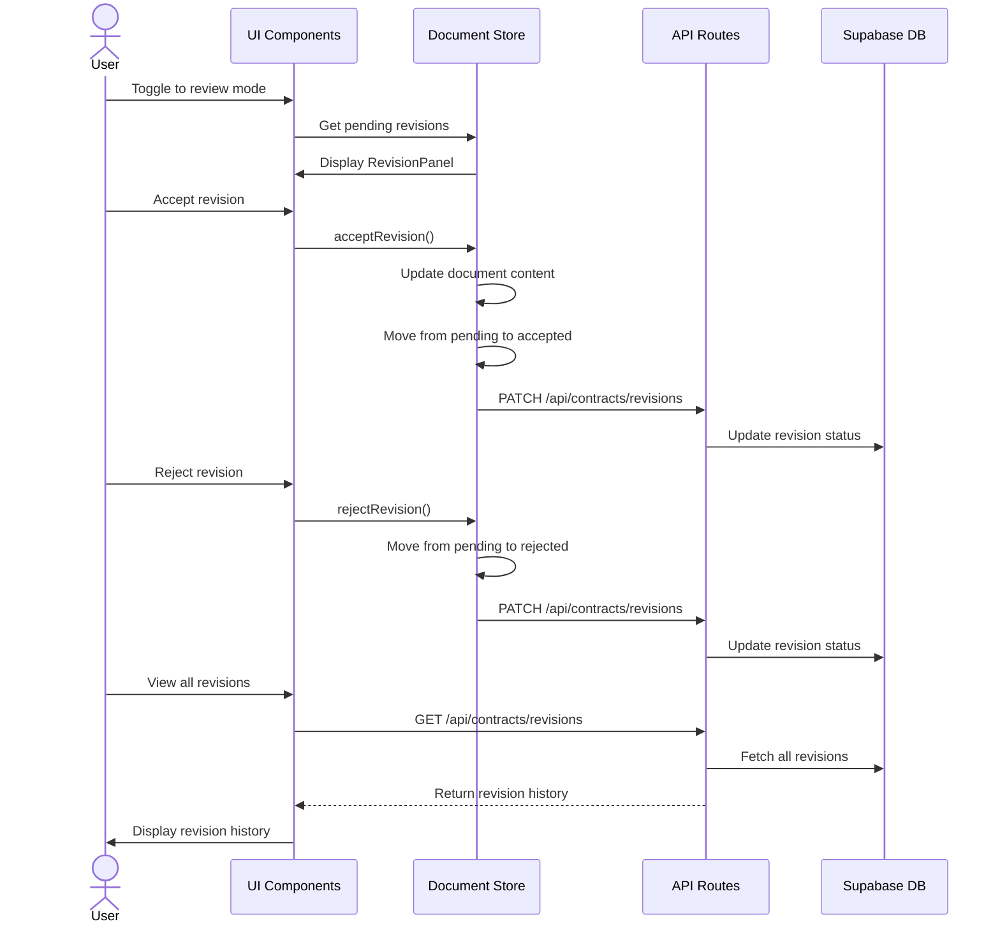
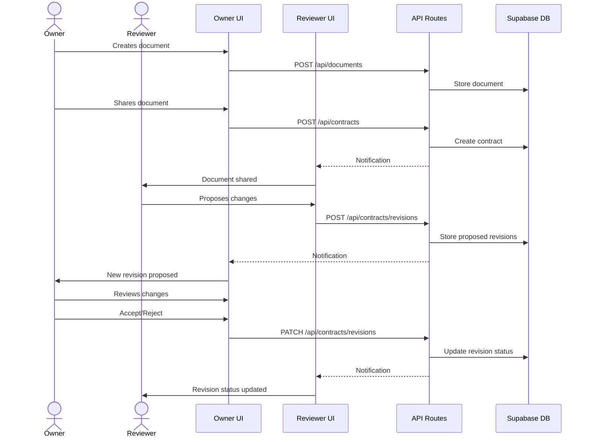

# User Flows

This document outlines the key user workflows in the TrustInk application, focusing on document analysis and revision management processes.

## Document Analysis Flow

The document analysis flow covers the process from document upload to AI-assisted analysis and modification.

### Step-by-Step Document Analysis

1. **Document Upload**
   - User uploads a document via the DocumentUploader component
   - Document is sent to the server, stored in Supabase storage, and metadata added to the documents table
   - Document is processed to extract sections

2. **Document Viewing**
   - User navigates to the document view page
   - Document is loaded from the server and displayed in the EditableDocumentViewer
   - Document sections are rendered with proper formatting

3. **AI Interaction**
   - User asks a question about the document via the AI assistant interface
   - Question is processed and AI analyzes the document
   - AI responds with insights and may highlight relevant sections

4. **Revision Proposing**
   - User requests a rewrite of a document section
   - AI proposes new text for the section
   - Proposed text is displayed alongside original text

5. **Revision Reviewing**
   - User reviews proposed changes
   - User accepts or rejects changes
   - Accepted changes update the document
   - Changes are stored in the database for all parties to review

## Revision Management Flow

The revision management flow covers how users interact with proposed changes to documents.

### Step-by-Step Revision Management

1. **Entering Review Mode**
   - User toggles to review mode in the document interface
   - System fetches all pending revisions for the current document
   - RevisionPanel displays pending revisions grouped by section

2. **Reviewing Changes**
   - User views proposed changes with original text comparison
   - System indicates whether changes were AI-generated or human-proposed
   - User can view comments associated with each proposed change

3. **Accepting Changes**
   - User selects a revision and accepts it
   - System updates the document with the new text
   - System marks the revision as accepted in the store
   - API updates the revision status in the database

4. **Rejecting Changes**
   - User selects a revision and rejects it
   - System leaves the document text unchanged
   - System marks the revision as rejected in the store
   - API updates the revision status in the database

5. **Viewing Revision History**
   - User can view all revisions (pending, accepted, rejected)
   - System fetches complete revision history from database
   - RevisionPanel displays revisions with status and timestamps

## Multi-User Workflow

For contracts involving multiple parties, the revision flow extends to include collaboration features.

### Key User Interface Elements

1. **Document Analysis Page**
   - Main interface for document viewing and AI interaction
   - Split view with document on one side and AI/revisions on the other
   - Toggle between AI assistant mode and revision mode

2. **EditableDocumentViewer**
   - Displays document sections with highlighting capability
   - Shows proposed changes inline
   - Provides edit interface for document sections

3. **RevisionPanel**
   - Lists all pending revisions
   - Groups revisions by document section
   - Provides accept/reject buttons for each revision
   - Shows revision history with status indicators

4. **TextAnimation**
   - Displays AI responses with typing animation
   - Integrates with voice capabilities via ElevenLabs
   - Provides visual feedback for AI processing

5. **DocumentUploader**
   - Provides file drag-and-drop interface
   - Validates document types and size
   - Shows upload progress feedback 