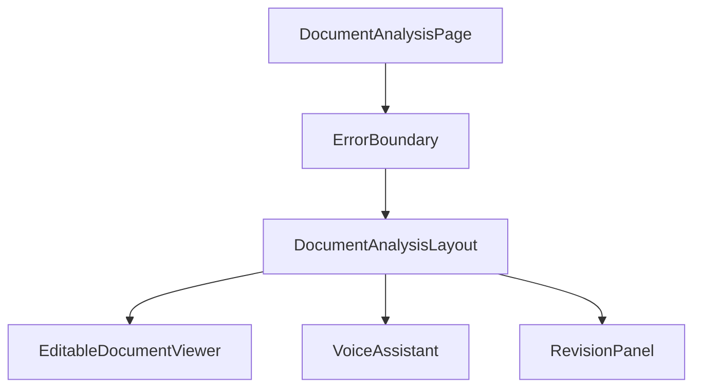
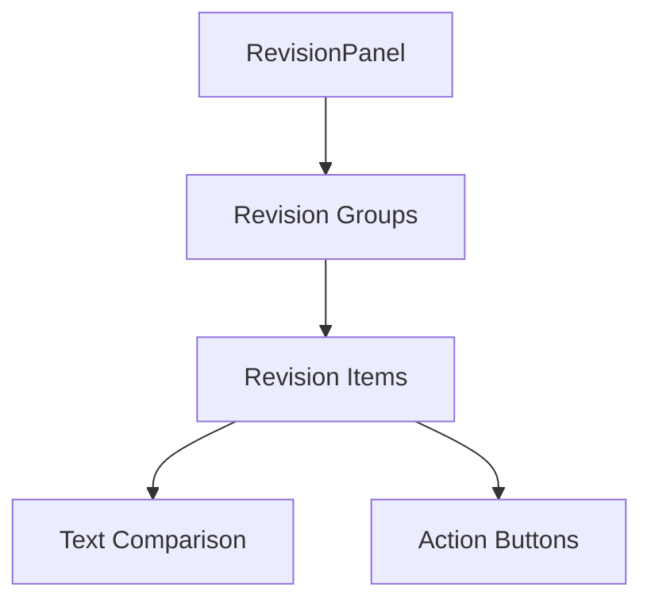
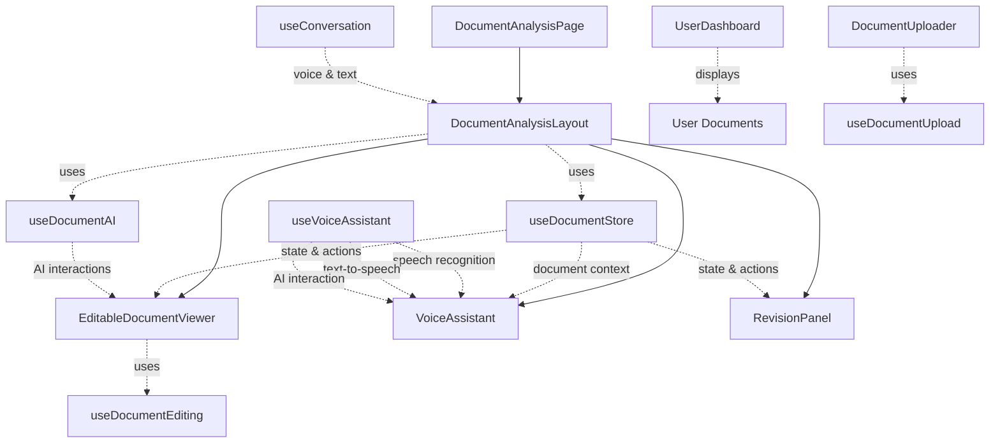
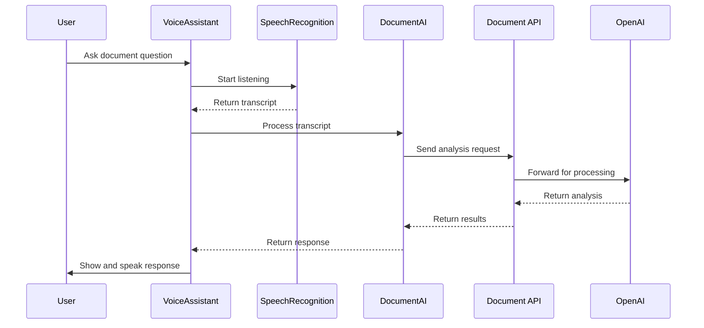

# Component Reference

This document provides a detailed reference for the key components in the TrustInk application, explaining their purpose, props, state, and interactions.

## Core Components

### DocumentAnalysisPage

The main page component for document analysis, serving as the entry point for document viewing and AI interaction.

**Location:** `src/app/(app)/documents/[id]/page.tsx`

**Responsibilities:**
- Fetches document data and analysis
- Provides error boundary for the document analysis content
- Wraps content in DocumentAnalysisLayout

**Structure:**


### DocumentAnalysisLayout

A layout component that organizes the document viewer alongside voice assistant and revision panels.

**Location:** `src/components/DocumentAnalysisLayout.tsx`

**Props:**
```typescript
interface DocumentAnalysisLayoutProps {
  documentId: string;
}
```

**State:**
- `activeTab`: Current active tab ('assistant' or 'revisions')

**Key Features:**
- Organizes document viewer and assistant panels in a split layout
- Provides tabbed interface between AI assistant and revision panels
- Handles loading states for document content

**Usage:**
```jsx
<DocumentAnalysisLayout documentId="doc-123" />
```

### EditableDocumentViewer

A component that displays document sections and enables editing and highlighting.

**Location:** `src/components/EditableDocumentViewer.tsx`

**Props:**
- None required, but exposes ref for external control

**Ref Interface:**
```typescript
interface EditableDocumentViewerRef {
  proposeEditFromAI: (sectionId: string, newText: string) => void;
  highlightSection: (sectionId: string | null) => void;
  getSections: () => EditableSection[];
}
```

**State:**
- `sections`: Array of document sections from the document store
- `editingSectionId`: ID of the section currently being edited
- `highlightedSectionId`: ID of the section currently highlighted

**Key Features:**
- Renders document sections with proper formatting
- Enables highlighting of sections via ref methods
- Provides inline editing capabilities
- Shows diff view for proposed changes

**Usage:**
```jsx
<EditableDocumentViewer ref={documentViewerRef} />
```

### VoiceAssistant

A component that provides voice-based interaction with documents, allowing users to ask questions and receive spoken responses.

**Location:** `src/components/VoiceAssistant.tsx`

**Props:**
```typescript
interface VoiceAssistantProps {
  className?: string;
}
```

**State:**
- `inputText`: The text entered by the user
- `messages`: Array of conversation messages between user and assistant
- `isProcessing`: Whether the assistant is processing a request

**Key Features:**
- Provides voice recognition for document questions
- Displays conversation history with AI assistant
- Offers text-to-speech for responses
- Enables both voice and text input options
- Handles processing states with visual feedback

**Usage:**
```jsx
<VoiceAssistant className="h-full" />
```

### RevisionPanel

A component that displays pending and accepted revisions for a document.

**Location:** `src/components/RevisionPanel.tsx`

**Props:**
```typescript
interface RevisionPanelProps {
  showAccepted?: boolean; // Whether to show accepted revisions
}
```

**State:**
- Derives state from the document store (pendingRevisions, revisions)

**Key Features:**
- Groups revisions by document section
- Displays original and proposed text for comparison
- Provides buttons to accept or reject revisions
- Shows revision history with status indicators
- Indicates if changes were AI-generated

**Structure:**


### DocumentUploader

A component for uploading documents with drag-and-drop support.

**Location:** `src/components/DocumentUploader.tsx`

**Props:**
```typescript
interface DocumentUploaderProps {
  onUploadComplete?: (documentId: string) => void;
  allowedTypes?: string[];
  maxSizeMB?: number;
}
```

**State:**
- `isUploading`: Boolean indicating active upload
- `progress`: Number indicating upload progress percentage
- `error`: String containing any error message

**Key Features:**
- File drag-and-drop interface
- File type validation (PDF, DOCX, etc.)
- Size limit validation
- Upload progress indicator
- Success/error messaging

**Usage:**
```jsx
<DocumentUploader 
  onUploadComplete={handleUploadComplete} 
  allowedTypes={['application/pdf']} 
  maxSizeMB={10} 
/>
```

### TextAnimation

A component that displays AI responses with typing animation and voice support.

**Location:** `src/components/TextAnimation.tsx`

**Props:**
```typescript
interface TextAnimationProps {
  currentText: string;
  isAudioPlaying?: boolean;
  onStartListening?: () => void;
  onStopListening?: () => void;
}
```

**State:**
- `displayedText`: Text currently visible in the animation
- `isTyping`: Boolean indicating if animation is in progress

**Key Features:**
- Animated typing effect for AI responses
- Integration with ElevenLabs for voice output
- Visual indicators for listening and speaking states
- Responsive design for different screen sizes

**Usage:**
```jsx
<TextAnimation 
  currentText={aiResponse}
  isAudioPlaying={isSpeaking}
  onStartListening={handleStartListening}
  onStopListening={handleStopListening}
/>
```

### UserDashboard

A component that displays a user's documents with filtering and sorting capabilities.

**Location:** `src/components/UserDashboard.tsx`

**Props:**
- None required

**State:**
- `documents`: Array of user's documents retrieved from the API
- `isLoading`: Boolean indicating if documents are being loaded
- `error`: Error message if document fetching fails

**Key Features:**
- Fetches and displays user's documents
- Shows loading, error, and empty states
- Formats document information (file size, dates)
- Links to document view pages

**Usage:**
```jsx
<UserDashboard />
```

## Provider Components

### DocumentAIProvider

A context provider that connects the AI assistant with document editing functionality.

**Location:** `src/providers/DocumentAIProvider.tsx`

**Context Value:**
```typescript
interface DocumentAIContextType {
  proposeEdit: (sectionId: string, newText: string) => void;
  highlightSection: (sectionId: string | null) => void;
  lastAction: AIAction;
  acceptLastEdit: () => void;
  rejectLastEdit: () => void;
  documentViewerRef: React.MutableRefObject<EditableDocumentViewerRef | null>;
}
```

**State:**
- `lastAction`: Tracks the last AI action (propose_edit, highlight, none)

**Key Features:**
- Provides methods for AI to propose edits to document sections
- Enables highlighting of relevant sections during AI analysis
- Tracks the last AI action for accept/reject workflows
- Creates a bridge between AI responses and document interface

**Usage:**
```jsx
<DocumentAIProvider>
  <YourComponent />
</DocumentAIProvider>

// In a component:
const { proposeEdit, highlightSection } = useDocumentAI();
```

## Custom Hooks

### useDocumentStore

A Zustand store hook for managing document state.

**Location:** `src/store/zustand.ts`

**State:**
```typescript
interface DocumentStoreState {
  currentDocument: Document | null;
  revisions: Record<string, ContractRevision>;
  pendingRevisions: SectionRevision[];
  activeRevisionSession: string | null;
  highlightedSection: string | null;
  isDocumentLoading: boolean;
}
```

**Actions:**
- `setCurrentDocument`: Sets the current document
- `setHighlightedSection`: Highlights a document section
- `updateDocumentSection`: Updates the text of a document section
- `proposeRevision`: Creates a new revision proposal
- `acceptRevision`: Accepts a pending revision
- `rejectRevision`: Rejects a pending revision
- `startRevisionSession`: Starts a new revision session
- `endRevisionSession`: Ends the current revision session
- `clearDocument`: Clears the current document

**Usage:**
```jsx
const { 
  currentDocument, 
  proposeRevision, 
  pendingRevisions,
  acceptRevision
} = useDocumentStore();
```

### useVoiceAssistant

A custom hook that provides voice recognition, text-to-speech, and AI interaction capabilities for document analysis.

**Location:** `src/hooks/useVoiceAssistant.ts`

**Options:**
```typescript
interface VoiceAssistantOptions {
  onResult?: (result: string) => void;
  onError?: (error: string) => void;
  autoStart?: boolean;
}
```

**State:**
- `isListening`: Whether voice recognition is active
- `isSpeaking`: Whether text-to-speech is active
- `transcript`: Current speech recognition transcript
- `lastResponse`: Last AI response text
- `isProcessing`: Whether the AI is processing a request

**Functions:**
- `startListening`: Starts voice recognition
- `stopListening`: Stops voice recognition
- `resetTranscript`: Clears the current transcript
- `speak`: Reads text aloud using speech synthesis
- `stopSpeaking`: Stops text-to-speech
- `sendMessage`: Sends a message to the AI for processing

**Usage:**
```jsx
const {
  isListening,
  transcript,
  lastResponse,
  startListening,
  stopListening,
  speak,
  sendMessage
} = useVoiceAssistant();
```

### useDocumentUpload

A custom hook that handles document file selection, validation, and uploading.

**Location:** `src/hooks/useDocumentUpload.ts`

**State:**
- `dragActive`: Boolean for drag-and-drop state
- `lastFile`: Last file that was processed
- `uploadError`: Error message from upload attempt
- `isProcessing`: Boolean for upload/processing state

**Functions:**
- `validateFile`: Validates file type and size
- `processFile`: Processes and uploads a file
- `setDragActive`: Updates drag state for UI feedback

**Usage:**
```jsx
const {
  dragActive,
  setDragActive,
  uploadError,
  lastFile,
  processFile,
  isProcessing
} = useDocumentUpload();
```

### useDocumentEditing

A custom hook that manages document section editing functionality.

**Location:** `src/hooks/useDocumentEditing.ts`

**State:**
- `sections`: Array of document sections with editing states
- `highlightedSection`: ID of currently highlighted section

**Functions:**
- `proposeEdit`: Proposes a new text for a section
- `acceptEdit`: Accepts a proposed edit
- `rejectEdit`: Rejects a proposed edit
- `startEditing`: Begins direct editing of a section
- `saveEdit`: Saves changes from direct editing
- `cancelEditing`: Cancels direct editing

**Usage:**
```jsx
const {
  sections,
  highlightedSection,
  setHighlightedSection,
  proposeEdit,
  acceptEdit,
  rejectEdit
} = useDocumentEditing();
```

### useDocumentAI

A custom hook that provides access to the DocumentAI context.

**Location:** `src/providers/DocumentAIProvider.tsx`

**Returns:**
- All DocumentAI context values (proposeEdit, highlightSection, etc.)

**Usage:**
```jsx
const { 
  proposeEdit, 
  highlightSection, 
  lastAction, 
  acceptLastEdit, 
  rejectLastEdit 
} = useDocumentAI();
```

## Component Dependencies



## Voice Integration Architecture

The voice assistant integration in TrustInk allows users to interact with documents using natural language.



### Voice Assistant Workflow

1. **User speaks or types a question** about the document
2. **Speech is converted to text** using the browser's SpeechRecognition API
3. **Text is sent to the document analysis API** with context about the current document
4. **The analysis service processes the request** (using mock responses for now, real OpenAI in production)
5. **Results are returned to the VoiceAssistant component**
6. **The response is displayed and spoken** using the SpeechSynthesis API
7. **Relevant document sections may be highlighted** based on the analysis 