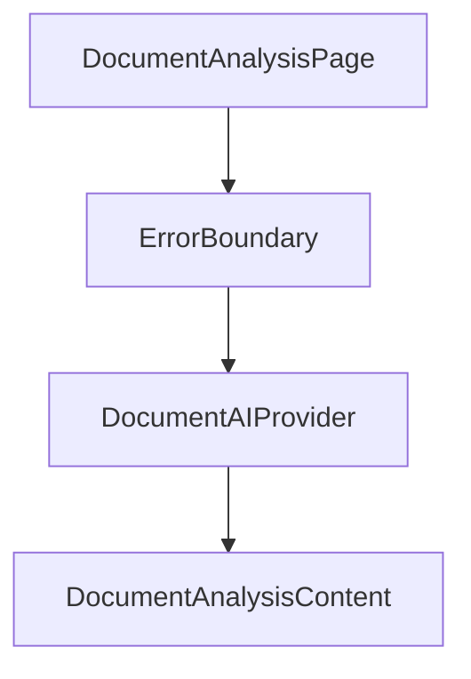
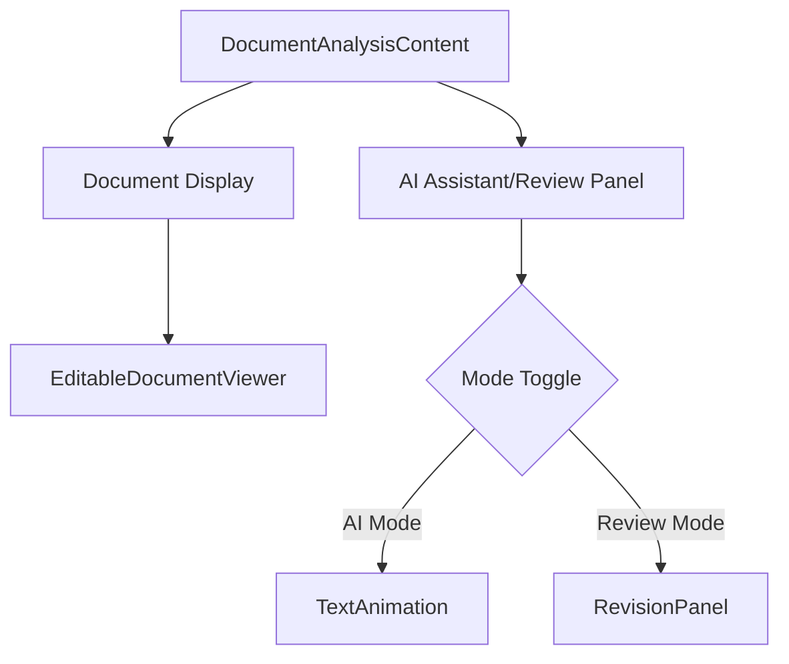
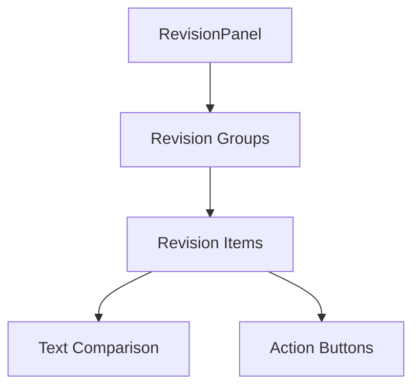
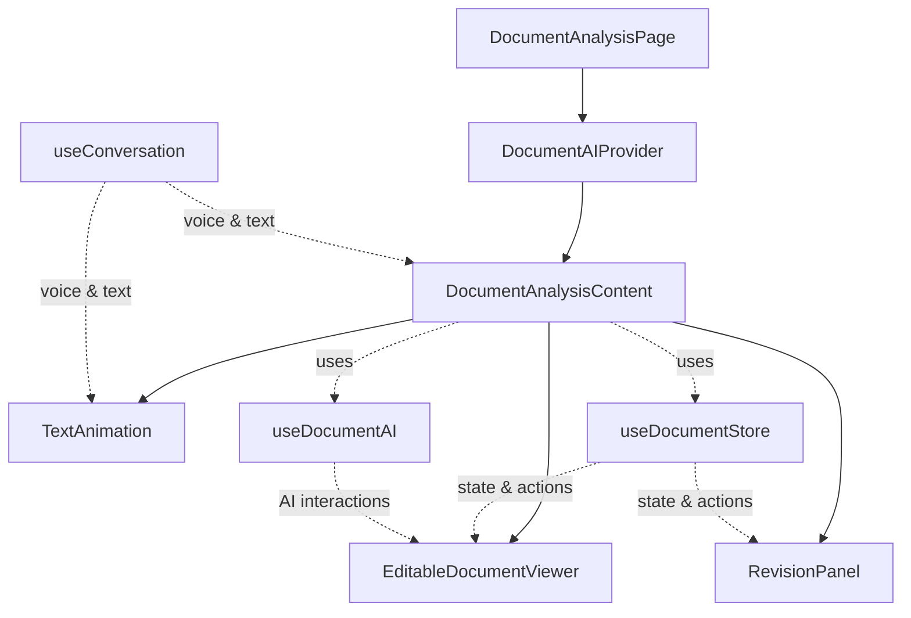

# Component Reference

This document provides a detailed reference for the key components in the TrustInk application, explaining their purpose, props, state, and interactions.

## Core Components

### DocumentAnalysisPage

The main page component for document analysis, serving as the entry point for document viewing and AI interaction.

**Location:** `src/app/(app)/documents/[id]/page.tsx`

**Responsibilities:**
- Provides error boundary for the document analysis content
- Wraps content in DocumentAIProvider

**Structure:**


### DocumentAnalysisContent

The main content component that handles document loading, user interactions, and AI responses.

**Location:** `src/app/(app)/documents/[id]/page.tsx`

**State:**
- `loading`: Boolean indicating if document is loading
- `analyzing`: Boolean indicating if AI is analyzing the document
- `documentName`: Name of the current document
- `currentText`: Current text being displayed by the AI
- `reviewMode`: Boolean to toggle between AI assistant and review mode

**Hooks:**
- `useDocumentStore`: Zustand store for document state
- `useDocumentAI`: Context for AI interaction
- `useConversation`: ElevenLabs hook for voice conversation

**Key Features:**
- Toggles between AI assistant and revision review modes
- Processes user questions and AI responses
- Handles document analysis through the API
- Manages AI-proposed edits and user approval workflow

**Structure:**


### EditableDocumentViewer

A component that displays document sections and enables editing and highlighting.

**Location:** `src/components/EditableDocumentViewer.tsx`

**Props:**
- None required, but exposes ref for external control

**Ref Interface:**
```typescript
interface EditableDocumentViewerRef {
  proposeEditFromAI: (sectionId: string, newText: string) => void;
  highlightSection: (sectionId: string | null) => void;
  getSections: () => EditableSection[];
}
```

**State:**
- `sections`: Array of document sections from the document store
- `editingSectionId`: ID of the section currently being edited
- `highlightedSectionId`: ID of the section currently highlighted

**Key Features:**
- Renders document sections with proper formatting
- Enables highlighting of sections via ref methods
- Provides inline editing capabilities
- Shows diff view for proposed changes

**Usage:**
```jsx
<EditableDocumentViewer ref={documentViewerRef} />
```

### RevisionPanel

A component that displays pending and accepted revisions for a document.

**Location:** `src/components/RevisionPanel.tsx`

**Props:**
```typescript
interface RevisionPanelProps {
  showAccepted?: boolean; // Whether to show accepted revisions
}
```

**State:**
- Derives state from the document store (pendingRevisions, revisions)

**Key Features:**
- Groups revisions by document section
- Displays original and proposed text for comparison
- Provides buttons to accept or reject revisions
- Shows revision history with status indicators
- Indicates if changes were AI-generated

**Structure:**


### DocumentUploader

A component for uploading documents with drag-and-drop support.

**Location:** `src/components/DocumentUploader.tsx`

**Props:**
```typescript
interface DocumentUploaderProps {
  onUploadComplete?: (documentId: string) => void;
  allowedTypes?: string[];
  maxSizeMB?: number;
}
```

**State:**
- `isUploading`: Boolean indicating active upload
- `progress`: Number indicating upload progress percentage
- `error`: String containing any error message

**Key Features:**
- File drag-and-drop interface
- File type validation (PDF, DOCX, etc.)
- Size limit validation
- Upload progress indicator
- Success/error messaging

**Usage:**
```jsx
<DocumentUploader 
  onUploadComplete={handleUploadComplete} 
  allowedTypes={['application/pdf']} 
  maxSizeMB={10} 
/>
```

### TextAnimation

A component that displays AI responses with typing animation and voice support.

**Location:** `src/components/TextAnimation.tsx`

**Props:**
```typescript
interface TextAnimationProps {
  currentText: string;
  isAudioPlaying?: boolean;
  onStartListening?: () => void;
  onStopListening?: () => void;
}
```

**State:**
- `displayedText`: Text currently visible in the animation
- `isTyping`: Boolean indicating if animation is in progress

**Key Features:**
- Animated typing effect for AI responses
- Integration with ElevenLabs for voice output
- Visual indicators for listening and speaking states
- Responsive design for different screen sizes

**Usage:**
```jsx
<TextAnimation 
  currentText={aiResponse}
  isAudioPlaying={isSpeaking}
  onStartListening={handleStartListening}
  onStopListening={handleStopListening}
/>
```

## Provider Components

### DocumentAIProvider

A context provider that connects the AI assistant with document editing functionality.

**Location:** `src/providers/DocumentAIProvider.tsx`

**Context Value:**
```typescript
interface DocumentAIContextType {
  proposeEdit: (sectionId: string, newText: string) => void;
  highlightSection: (sectionId: string | null) => void;
  lastAction: AIAction;
  acceptLastEdit: () => void;
  rejectLastEdit: () => void;
  documentViewerRef: React.MutableRefObject<EditableDocumentViewerRef | null>;
}
```

**State:**
- `lastAction`: Tracks the last AI action (propose_edit, highlight, none)

**Key Features:**
- Provides methods for AI to propose edits to document sections
- Enables highlighting of relevant sections during AI analysis
- Tracks the last AI action for accept/reject workflows
- Creates a bridge between AI responses and document interface

**Usage:**
```jsx
<DocumentAIProvider>
  <YourComponent />
</DocumentAIProvider>

// In a component:
const { proposeEdit, highlightSection } = useDocumentAI();
```

## Custom Hooks

### useDocumentStore

A Zustand store hook for managing document state.

**Location:** `src/store/zustand.ts`

**State:**
```typescript
interface DocumentStoreState {
  currentDocument: Document | null;
  revisions: Record<string, ContractRevision>;
  pendingRevisions: SectionRevision[];
  activeRevisionSession: string | null;
  highlightedSection: string | null;
  isDocumentLoading: boolean;
}
```

**Actions:**
- `setCurrentDocument`: Sets the current document
- `setHighlightedSection`: Highlights a document section
- `updateDocumentSection`: Updates the text of a document section
- `proposeRevision`: Creates a new revision proposal
- `acceptRevision`: Accepts a pending revision
- `rejectRevision`: Rejects a pending revision
- `startRevisionSession`: Starts a new revision session
- `endRevisionSession`: Ends the current revision session
- `clearDocument`: Clears the current document

**Usage:**
```jsx
const { 
  currentDocument, 
  proposeRevision, 
  pendingRevisions,
  acceptRevision
} = useDocumentStore();
```

### useDocumentAI

A custom hook that provides access to the DocumentAI context.

**Location:** `src/providers/DocumentAIProvider.tsx`

**Returns:**
- All DocumentAI context values (proposeEdit, highlightSection, etc.)

**Usage:**
```jsx
const { 
  proposeEdit, 
  highlightSection, 
  lastAction, 
  acceptLastEdit, 
  rejectLastEdit 
} = useDocumentAI();
```

## Component Dependencies



## Key Component Interfaces

### EditableDocumentViewer Ref

The EditableDocumentViewer exposes a ref interface for AI interaction, allowing direct control of the document view from the AI context.

```typescript
// This is the ref passed to EditableDocumentViewer
const documentViewerRef = useRef<EditableDocumentViewerRef | null>(null);

// Implementing the ref in EditableDocumentViewer
useImperativeHandle(ref, () => ({
  proposeEditFromAI: (sectionId: string, newText: string) => {
    proposeEdit(sectionId, newText);
  },
  highlightSection: (sectionId: string | null) => {
    setHighlightedSectionId(sectionId);
  },
  getSections: () => sections
}));
```

This pattern enables the AI to control the document viewer without tightly coupling the components. 