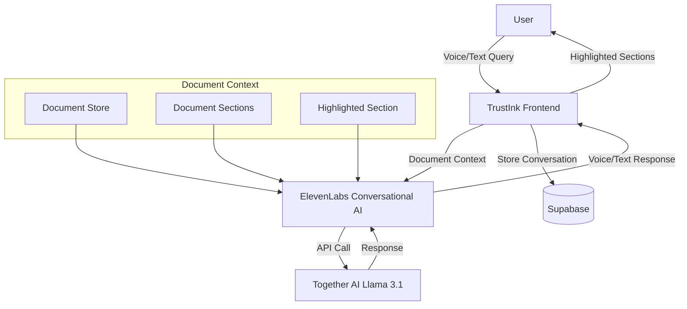
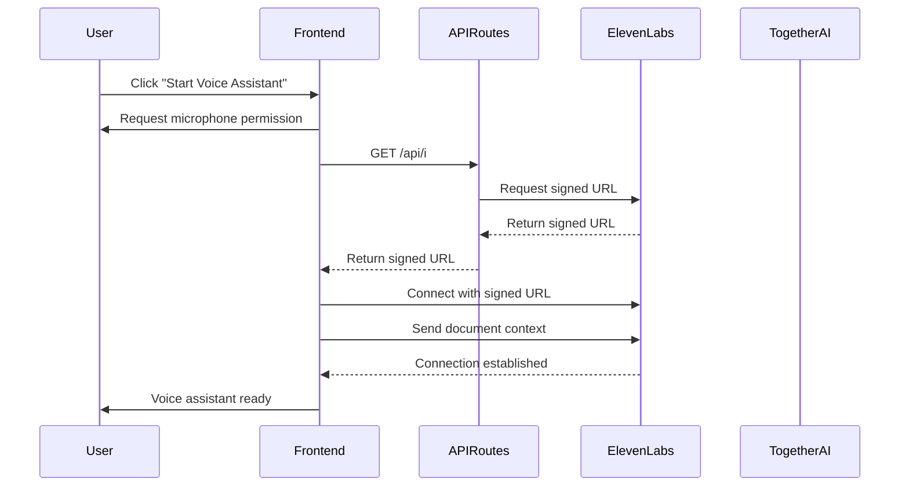
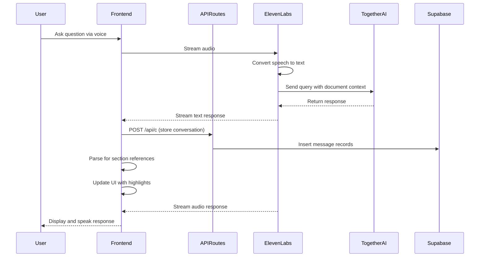

# ElevenLabs and Together AI Integration

This document outlines the technical architecture for integrating ElevenLabs Conversational AI with Together AI's Language Models in the TrustInk document management system.

## Architecture Overview

TrustInk's voice assistant functionality will be enhanced by combining:

1. **ElevenLabs Conversational AI**: For natural speech interaction and voice synthesis
2. **Together AI (Llama 3.1)**: For document understanding and contextual responses
3. **TrustInk Document Context**: For document-aware conversations



## System Components

### 1. ElevenLabs Integration

ElevenLabs Conversational AI provides a complete voice interaction platform:

- **Speech Recognition**: Converts spoken queries to text
- **Voice Synthesis**: Converts text responses to lifelike speech
- **Turn Taking**: Manages conversation flow and interruptions
- **Websocket Communication**: Real-time bidirectional communication

#### Configuration Requirements

```typescript
// Environment variables
AGENT_ID=<elevenlabs-agent-id>
XI_API_KEY=<elevenlabs-api-key>
```

#### API Routes

TrustInk implements two custom API routes to facilitate the ElevenLabs integration:

1. **`/api/i` Route**: Securely obtains a signed URL for connecting to ElevenLabs
   ```typescript
   // src/app/api/i/route.ts
   export async function POST(request: Request) {
     let agentId = process.env.AGENT_ID
     let apiKey = process.env.XI_API_KEY
     
     // Validate credentials
     if (!agentId) throw Error('AGENT_ID is not set or received.')
     if (!apiKey) throw Error('XI_API_KEY is not set or received.')
     
     // Get signed URL from ElevenLabs
     const apiUrl = new URL('https://api.elevenlabs.io/v1/convai/conversation/get_signed_url')
     apiUrl.searchParams.set('agent_id', agentId)
     const response = await fetch(apiUrl.toString(), {
       headers: { 'xi-api-key': apiKey },
     })
     
     // Return signed URL to client
     const data = await response.json()
     return NextResponse.json({ apiKey: data.signed_url })
   }
   ```

2. **`/api/c` Route**: Manages conversation persistence in Supabase
   ```typescript
   // src/app/api/c/route.ts
   export async function POST(request: Request) {
     const { id, item } = await request.json()
     
     // Store message in database
     const supabase = await createClient()
     const { error } = await insertMessage(
       supabase,
       {
         id: item.id,
         session_id: id,
         content_type: item.content[0].type,
         content_transcript: item.content[0].transcript,
         role: item.role,
         status: item.status,
         type: item.type,
         object: item.object
       }
     )
     
     // Handle results
     if (error) {
       return NextResponse.json({ error: 'Failed to store message' }, { status: 500 })
     }
     
     return NextResponse.json({})
   }
   ```

### 2. Together AI (Llama 3.1) Configuration

Together AI's Llama 3.1 will be configured as the language model for ElevenLabs:

- **Model Selection**: `meta-llama/Meta-Llama-3.1-70B-Instruct-Turbo` for optimal performance
- **Function Calling**: Enables structured outputs and tool use
- **Context Length**: 8k+ tokens to handle document content

#### ElevenLabs Agent Configuration

The ElevenLabs agent will be configured to:

1. Use Together AI for LLM processing
2. Set appropriate system prompts for document understanding
3. Configure function schemas for document interactions

```json
{
  "agentName": "TrustInk Document Assistant",
  "llmConfig": {
    "provider": "custom",
    "url": "https://api.together.xyz/v1",
    "model": "meta-llama/Meta-Llama-3.1-70B-Instruct-Turbo",
    "apiKey": "${TOGETHER_API_KEY}"
  },
  "systemPrompt": "You are a document analysis assistant that helps users understand legal contracts and documents. When responding to questions, reference specific sections from the document provided in context. If a section is highlighted, prioritize that section in your analysis.",
  "functions": [
    {
      "name": "highlightSection",
      "description": "Highlight a section in the document",
      "parameters": {
        "type": "object",
        "properties": {
          "sectionId": {
            "type": "string",
            "description": "ID of the section to highlight"
          }
        },
        "required": ["sectionId"]
      }
    },
    {
      "name": "getSectionContent",
      "description": "Get content of a specific section",
      "parameters": {
        "type": "object",
        "properties": {
          "sectionId": {
            "type": "string",
            "description": "ID of the section to retrieve"
          }
        },
        "required": ["sectionId"]
      }
    }
  ]
}
```

### 3. Frontend Integration with React

The TrustInk frontend will integrate ElevenLabs using the `@11labs/react` package:

```typescript
// Component using conversational AI
import { useConversation } from '@11labs/react'
import { useDocumentStore } from '@/store/zustand'
import { useState, useEffect, useCallback } from 'react'

export function DocumentAssistant() {
  const { currentDocument, highlightedSection, setHighlightedSection } = useDocumentStore()
  const [messages, setMessages] = useState([])
  
  // Initialize conversation
  const conversation = useConversation({
    onError: (error) => {
      // Handle error
    },
    onConnect: () => {
      // Successfully connected
    },
    onMessage: (props) => {
      const { message, source } = props
      
      // Add message to UI
      setMessages(prev => [...prev, {
        role: source === 'ai' ? 'assistant' : 'user',
        content: message
      }])
      
      // Store in database
      storeMessage(message, source)
    }
  })
  
  // Connect to ElevenLabs
  const connectToConversation = useCallback(async () => {
    // Request microphone access
    await navigator.mediaDevices.getUserMedia({ audio: true })
    
    // Get signed URL
    const response = await fetch('/api/i', {
      method: 'POST',
      headers: { 'Content-Type': 'application/json' }
    })
    const data = await response.json()
    
    // Start session with document context
    await conversation.startSession({
      signedUrl: data.apiKey,
      initialContext: getDocumentContext()
    })
  }, [conversation])
  
  // Get document context for LLM
  const getDocumentContext = useCallback(() => {
    if (!currentDocument) return ''
    
    // Format document sections for context
    return `
      Document: ${currentDocument.name}
      
      Sections:
      ${currentDocument.sections.map(section => 
        `ID: ${section.id}
         Content: ${section.text}
         ${highlightedSection === section.id ? '(Currently highlighted)' : ''}`
      ).join('\n\n')}
    `
  }, [currentDocument, highlightedSection])
  
  // Store message in database
  const storeMessage = useCallback(async (message, source) => {
    await fetch('/api/c', {
      method: 'POST',
      headers: { 'Content-Type': 'application/json' },
      body: JSON.stringify({
        id: sessionId,
        item: {
          id: `message_${Date.now()}`,
          role: source === 'ai' ? 'assistant' : 'user',
          status: 'completed',
          type: 'message',
          object: 'realtime.item',
          content: [{ type: 'text', transcript: message }]
        }
      })
    })
  }, [sessionId])
  
  return (
    <div className="conversation-container">
      {/* Conversation UI */}
      <button onClick={connectToConversation}>
        Start Voice Assistant
      </button>
      
      <div className="messages">
        {messages.map((message, index) => (
          <div key={index} className={`message ${message.role}`}>
            {message.content}
          </div>
        ))}
      </div>
    </div>
  )
}
```

## Document Context Integration

### 1. Sending Document Context to ElevenLabs

The key to effective document-aware conversations is properly formatting document context for the LLM:

```typescript
// Example context formation
const getDocumentContext = () => {
  if (!currentDocument) return ''
  
  let context = `
    Document Name: ${currentDocument.name}
    Document Type: ${currentDocument.type}
    
    DOCUMENT SECTIONS:
  `
  
  // Add each section
  currentDocument.sections.forEach(section => {
    context += `
      Section ID: ${section.id}
      ${section.title ? `Title: ${section.title}` : ''}
      Content: ${section.text}
      ${highlightedSection === section.id ? '[CURRENTLY HIGHLIGHTED]' : ''}
      
    `
  })
  
  // Add any additional metadata
  if (currentDocument.metadata) {
    context += `
      Additional Information:
      ${JSON.stringify(currentDocument.metadata, null, 2)}
    `
  }
  
  return context
}
```

### 2. Processing LLM Responses for Section Highlighting

The system needs to parse LLM responses to identify when sections should be highlighted:

```typescript
// Response processing
const handleAIResponse = (response) => {
  // Check if response mentions specific sections
  currentDocument.sections.forEach(section => {
    // Use regex to find references to section IDs or content
    const mentionsSectionId = new RegExp(`section\\s*${section.id}`, 'i').test(response)
    const mentionsSectionTitle = section.title && response.includes(section.title)
    
    // If section is mentioned prominently, highlight it
    if (mentionsSectionId || mentionsSectionTitle) {
      setHighlightedSection(section.id)
    }
  })
  
  // Display the response
  setLastResponse(response)
}
```

## Data Flow

### 1. Conversation Initialization



### 2. User Query and Response



## Implementation Phases

### Phase 1: Infrastructure Setup (Week 1-2)

1. Set up ElevenLabs agent with proper configuration
2. Create Together AI account and API integration
3. Implement API routes for ElevenLabs connection
4. Set up database schema for conversation storage

### Phase 2: Frontend Integration (Week 3-4)

1. Implement `useConversation` hook integration
2. Create document context formatting
3. Build conversation UI components
4. Implement section highlighting logic

### Phase 3: Testing & Refinement (Week 5-6)

1. Test with various document types
2. Optimize prompts for document understanding
3. Refine conversation flow and UI
4. Fine-tune section highlighting accuracy

## Best Practices

### Security Considerations

1. **API Key Management**:
   - Never expose API keys in frontend code
   - Use server-side routes to obtain signed URLs
   - Implement appropriate rate limiting

2. **Conversation Data**:
   - Apply appropriate retention policies
   - Ensure user data is associated with correct user ID
   - Consider encryption for sensitive document content

### Performance Optimization

1. **Document Context Size**:
   - Limit context size for large documents
   - Consider chunking document sections
   - Prioritize currently viewed/highlighted sections

2. **Response Time**:
   - Use streaming responses for faster initial feedback
   - Implement progressive rendering of responses
   - Show typing indicators during processing

### Maintenance and Monitoring

1. **Logging**:
   - Log connection establishment attempts
   - Track conversation metrics (turns, duration, etc.)
   - Monitor API usage for cost management

2. **Analytics**:
   - Measure response quality and relevance
   - Track section highlighting accuracy
   - Capture user correction behaviors

## Conclusion

The integration of ElevenLabs Conversational AI with Together AI's Llama 3.1 model provides TrustInk with a powerful voice interface for document interaction. By properly managing document context and section highlighting, the system will deliver natural conversations that are truly document-aware, enhancing the overall user experience for document analysis and understanding. 