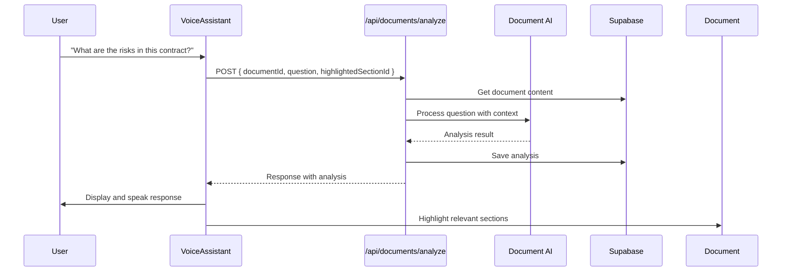
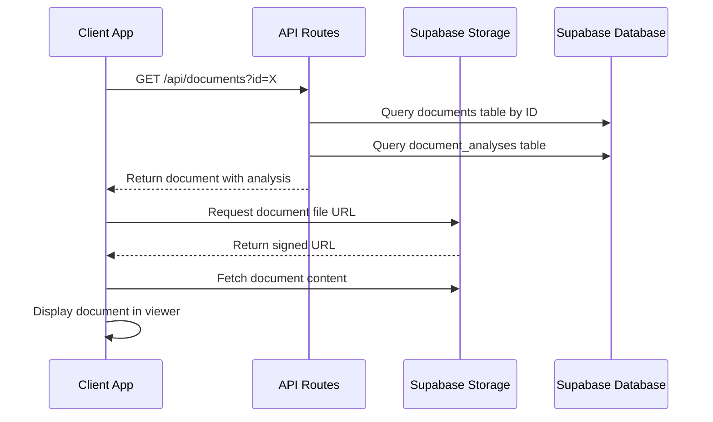
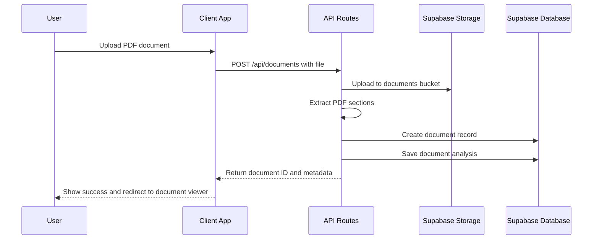

# PDF Processing System Architecture

This document outlines the architectural design of the PDF upload, processing, and viewing system within TrustInk, including voice assistant capabilities.

## System Overview

The PDF processing system provides a complete workflow for document management, from upload to AI-powered analysis and collaborative editing, with voice interaction features. The architecture consists of several interconnected components designed to handle different aspects of the workflow:

```
┌────────────────┐       ┌─────────────────┐       ┌──────────────────┐
│                │       │                 │       │                  │
│  Client-side   │◄─────►│  Next.js API    │◄─────►│   Supabase       │
│  Components    │       │  Endpoints      │       │   Services       │
│                │       │                 │       │                  │
└───────┬────────┘       └────────┬────────┘       └─────────┬────────┘
        │                         │                          │
        │                         │                          │
        ▼                         ▼                          ▼
┌────────────────┐       ┌─────────────────┐       ┌──────────────────┐
│                │       │                 │       │                  │
│  Document      │       │  PDF            │       │  Document        │
│  State         │       │  Processing     │       │  Analysis        │
│  Management    │       │  Services       │       │  Services        │
│                │       │                 │       │                  │
└────────────────┘       └─────────────────┘       └──────────────────┘
                                                            │
                                                            │
                                                            ▼
                                                   ┌──────────────────┐
                                                   │                  │
                                                   │  Voice           │
                                                   │  Assistant       │
                                                   │  Interface       │
                                                   │                  │
                                                   └──────────────────┘
```

## Component Architecture

### 1. Client-side Components

#### DocumentUploader
- **Purpose**: Handles file selection, validation, and upload to the server
- **Dependencies**: 
  - `useDocumentStore` for state management
  - API layer for communication with backend
- **Key Features**:
  - PDF file validation
  - Form submission handling
  - Upload progress tracking
  - Error handling and user feedback

#### EditableDocumentViewer
- **Purpose**: Renders PDF document content and manages interactive elements
- **Dependencies**:
  - `useDocumentStore` for document state
  - `RevisionPanel` for displaying revision history
- **Key Features**:
  - Section-based content display
  - Highlighting and selection
  - Interactive editing capabilities
  - Integration with AI analysis

#### VoiceAssistant
- **Purpose**: Provides voice-based interaction with documents
- **Dependencies**:
  - `useVoiceAssistant` hook for speech recognition and synthesis
  - Document analysis API for processing requests
  - `useDocumentStore` for document context
- **Key Features**:
  - Speech recognition for document questions
  - Text-to-speech for AI responses
  - Conversation history display
  - Document context-aware analysis
  - Section highlighting based on AI analysis

#### DocumentAnalysisLayout
- **Purpose**: Orchestrates document viewer, voice assistant, and revision panel
- **Dependencies**:
  - `EditableDocumentViewer` for document rendering
  - `VoiceAssistant` for voice interaction
  - `RevisionPanel` for revision management
- **Key Features**:
  - Split-view layout for document and assistant
  - Tab navigation between assistant and revisions
  - Responsive design for different screen sizes

#### DocumentAIProvider
- **Purpose**: Context provider for AI interactions related to document analysis
- **Dependencies**:
  - AI conversation services
  - Document state management
- **Key Features**:
  - Manages AI conversation state
  - Provides document context to AI
  - Handles AI responses and highlighting

### 2. API Endpoints

#### /api/documents
- **Purpose**: Handle document CRUD operations
- **Methods**:
  - `POST`: Upload new document
  - `GET`: Retrieve document metadata
  - `PUT`: Update document properties
  - `DELETE`: Remove document
- **Key Functions**:
  - File validation and sanitization
  - Storage in Supabase bucket
  - Database record creation
  - Error handling

#### /api/documents/analyze
- **Purpose**: Process and analyze document content
- **Methods**:
  - `POST`: Submit document for analysis with optional query
  - `GET`: Retrieve analysis results
- **Key Functions**:
  - PDF text extraction
  - Section identification
  - AI-powered analysis
  - Natural language query processing for voice assistant
  - Result storage and caching

#### /api/documents/revisions
- **Purpose**: Manage document revisions and collaborative editing
- **Methods**:
  - `POST`: Create new revision
  - `GET`: Retrieve revision history
  - `PUT`: Update revision status
- **Key Functions**:
  - Track content changes
  - Manage revision approval flow
  - Version control

### 3. Supabase Integration

#### Storage Service
- **Purpose**: Store document files and related assets
- **Buckets**:
  - `documents`: Original PDF files
  - `revisions`: Document revision snapshots
- **Key Features**:
  - Access control and permissions
  - File lifecycle management
  - Content delivery optimization

#### Database Schema

```
┌─────────────────┐       ┌─────────────────┐       ┌─────────────────┐
│  documents      │       │  document_       │       │  revisions      │
│                 │       │  analyses        │       │                 │
│  id             │       │  id              │       │  id             │
│  name           │       │  document_id     │       │  document_id    │
│  user_id        │◄──────┤  content         │       │  section_id     │
│  path           │       │  query           │       │  content        │
│  created_at     │       │  created_at      │       │  status         │
│  updated_at     │       │  updated_at      │       │  created_at     │
└────────┬────────┘       └─────────────────┘       │  updated_at     │
         │                                          └─────────────────┘
         │                                                  ▲
         │                                                  │
         └──────────────────────────────────────────────────┘
```

### 4. PDF Processing Services

#### Text Extraction Service
- **Purpose**: Extract textual content from PDF documents
- **Technology**: Combination of pdf-lib and pdf.js
- **Key Functions**:
  - Text extraction by position and page
  - Font and style processing
  - Structure identification
  - OCR fallback for scanned documents

#### Section Detection Service
- **Purpose**: Identify logical sections within document content
- **Algorithms**:
  - Heading detection
  - Paragraph grouping
  - Layout analysis
  - Semantic clustering
- **Output**: Structured document with identified sections

### 5. Voice Assistant Architecture

#### Speech Recognition Service
- **Purpose**: Convert spoken input to text
- **Technology**: Web Speech API (SpeechRecognition)
- **Key Functions**:
  - Real-time speech capture
  - Convert speech to text
  - Handle recognition errors
  - Continuous listening mode

#### Text-to-Speech Service
- **Purpose**: Convert AI responses to spoken output
- **Technology**: Web Speech API (SpeechSynthesis)
- **Key Functions**:
  - Text-to-speech conversion
  - Voice selection
  - Speech rate and pitch control
  - Speaking state management

#### Conversation Management
- **Purpose**: Track and display conversation history
- **Key Functions**:
  - Message history storage
  - User and assistant message formatting
  - Loading state handling
  - Error recovery

### 6. Document Analysis Services

#### AI Analysis Service
- **Purpose**: Apply AI to analyze document content
- **Features**:
  - Risk assessment for contract sections
  - Language analysis for clarity and issues
  - Summarization and key point extraction
  - Question answering based on document content
- **Integration**: OpenAI or similar LLM provider

#### Query Processing Service
- **Purpose**: Handle natural language queries about documents
- **Key Functions**:
  - Convert questions to structured queries
  - Identify document regions relevant to queries
  - Generate contextual responses
  - Highlight relevant document sections

## State Management

The application uses Zustand for client-side state management, with several stores:

### Document Store
- Manages current document state
- Tracks loading and processing states
- Handles section highlighting and selection

```typescript
interface DocumentState {
  currentDocument: Document | null;
  isDocumentLoading: boolean;
  highlightedSection: string | null;
  
  setCurrentDocument: (document: Document) => void;
  setDocumentLoading: (loading: boolean) => void;
  setHighlightedSection: (sectionId: string | null) => void;
}
```

### Voice Assistant State
- Manages voice recognition and synthesis state
- Tracks conversation history and processing state

```typescript
interface VoiceAssistantState {
  isListening: boolean;
  isSpeaking: boolean;
  transcript: string;
  lastResponse: string;
  isProcessing: boolean;
  messages: Array<{ role: 'user' | 'assistant', content: string }>;
}
```

### Revision Store
- Manages document revision state
- Tracks pending and approved revisions
- Handles revision creation and updates

```typescript
interface RevisionState {
  revisions: Revision[];
  pendingRevisions: Revision[];
  
  addRevision: (revision: Revision) => void;
  approveRevision: (revisionId: string) => void;
  rejectRevision: (revisionId: string) => void;
}
```

## Data Flow

### Voice Assistant Flow

1. User speaks to voice assistant through `VoiceAssistant` component
2. Speech is converted to text via `useVoiceAssistant` hook
3. Query is sent to `/api/documents/analyze` with current document context
4. API processes query using `document-ai.ts` utilities
5. Response is returned to voice assistant
6. Assistant displays response and optionally speaks it
7. Relevant document sections may be highlighted



### Document Upload Flow

1. User selects PDF file in `DocumentUploader` component
2. Client validates file type and size
3. File is sent to `/api/documents` endpoint via `FormData`
4. API validates file and uploads to Supabase storage
5. API creates document record in database
6. API initiates document processing (text extraction)
7. Document ID and metadata returned to client
8. Client updates document store with new document
9. User is redirected to document viewer

### Document Viewing Flow

1. User navigates to document page with document ID
2. Page component fetches document metadata from `/api/documents`
3. Page component fetches document analysis from `/api/documents/analyze`
4. Document state is updated with fetched data
5. `EditableDocumentViewer` renders document sections
6. `VoiceAssistant` initializes for document interaction
7. User can interact with document sections, voice assistant, and revision panel

### Document Retrieval Flow



## Security Considerations

1. **Authentication and Authorization**
   - All API endpoints require authenticated users
   - Document access is restricted to owners and collaborators
   - Storage bucket policies enforce access control

2. **Voice Privacy**
   - Speech recognition happens client-side for privacy
   - No voice data is stored on servers
   - Users can disable voice features if preferred

3. **Input Validation**
   - File validation for type, size, and content
   - API input validation for all endpoints
   - Sanitization of user-generated content

4. **Storage Security Rules**
   - Files are only accessible via signed URLs
   - URLs expire after a short time period (typically 1 hour)
   - Direct bucket access is restricted
   - Files are named with user IDs to enforce ownership

5. **Database RLS Policies**
   - Row-level security ensures users can only access their own documents
   - Policies are defined in the schema.sql file
   - All database access goes through utility functions that enforce user checks

## Scalability Considerations

1. **Storage Scaling**
   - Supabase storage can scale to handle increased document volume
   - CDN integration for efficient content delivery

2. **Processing Scaling**
   - Separate document processing from request handling
   - Queue-based processing for large documents
   - Distributed processing for high loads

3. **AI Service Scaling**
   - Caching for frequent queries
   - Request rate limiting
   - Batch processing for analysis

## Future Architecture Extensions

1. **Real-time Collaboration**
   - WebSocket integration for live updates
   - Operational transformation for concurrent editing
   - Presence indicators for collaborative sessions

2. **Advanced Voice Capabilities**
   - Custom voice models for professional responses
   - Voice authentication for secure operations
   - Multi-language voice support

3. **Enhanced AI Integration**
   - Domain-specific model fine-tuning
   - Custom language models for document analysis
   - Automated document summarization and classification
   - Predictive suggestions for document editing

## Mock Implementation

For development and testing purposes, the system includes mock implementations:

1. **Mock PDF Document**
   - Base64-encoded sample contract
   - Pre-defined sections with contract clauses
   - Test utility to create File objects

2. **Mock Analysis Results**
   - Pre-defined responses for common question types
   - Risk assessment for sample contract sections
   - Section-specific analysis for highlighted content

3. **Speech Recognition Simulation**
   - Text input fallback when voice recognition is unavailable
   - Test mode to simulate voice recognition
   - Configurable recognition delay for testing

## Storage Structure

TrustInk uses Supabase storage for document management with three primary buckets:

1. **`pdf-documents`**: Primary bucket for storing the original uploaded PDF files
   - **Path format**: `userId_timestamp.pdf`
   - **Access control**: Private, accessible only by document owner
   - **Purpose**: Preserves the original document without modifications

2. **`documents`**: General purpose bucket for derived document assets
   - **Path format**: `userId_timestamp.fileExtension`
   - **Access control**: Private, accessible only by document owner
   - **Purpose**: Stores processed files, thumbnails, and exported versions

3. **`voice_recordings`**: Stores voice interaction recordings (when enabled)
   - **Path format**: `userId_sessionId_timestamp.webm`
   - **Access control**: Private, accessible only by recording owner
   - **Purpose**: Stores user voice recordings when explicitly enabled

## Document Upload Implementation

The document upload functionality is implemented through several components:

1. **`DocumentUploader` Component**: Provides the user interface for document uploads
   - Drag-and-drop interface
   - File type validation (PDF only)
   - Size validation (10MB limit)
   - Progress and error states

2. **`useDocumentUpload` Hook**: Encapsulates upload business logic
   - File validation
   - PDF pre-processing with pdf-lib
   - API integration
   - Error handling

3. **API Route**: Handles server-side document processing
   - Validates authentication with Clerk
   - Uploads file to Supabase storage
   - Creates document database record
   - Extracts basic sections from PDF
   - Stores document analysis metadata

### Upload Flow



### Code Implementation Details

#### Document Upload Function

```typescript
// From src/lib/supabase.ts
export const uploadDocumentFile = async (
  supabase: SupabaseClient,
  fileName: string,
  fileBuffer: ArrayBuffer,
  contentType: string
) => {
  return await supabase
    .storage
    .from('documents')  // Currently using 'documents' bucket
    .upload(fileName, fileBuffer, {
      contentType,
      upsert: false
    });
};
```

#### Document Storage in API Route

```typescript
// From src/app/api/documents/route.ts (POST method)
// Create a unique filename
const timestamp = new Date().getTime();
const fileExtension = file.name.split('.').pop();
const fileName = `${userId}_${timestamp}.${fileExtension}`;

// Upload the file
const { data: storageData, error: storageError } = await uploadDocumentFile(
  supabase,
  fileName,
  fileBuffer,
  file.type
);
```

#### Client-Side Upload Processing

```typescript
// From src/hooks/useDocumentUpload.ts
const processFile = useCallback(async (file: File) => {
  // Validate file (type, size)
  if (!validateFile(file)) {
    return null;
  }

  try {
    setDocumentLoading(true);
    
    // Read file and prepare for upload
    const arrayBuffer = await file.arrayBuffer();
    
    // Upload via API
    const formData = new FormData();
    formData.append('file', file);
    formData.append('name', file.name);
    
    const response = await fetch('/api/documents', {
      method: 'POST',
      body: formData,
    }).then(res => {
      if (!res.ok) throw new Error(`Server error: ${res.status}`);
      return res.json();
    });
    
    // Update local document state
    setCurrentDocument({
      id: response.id,
      name: file.name,
      file: file,
      pdfBytes: uint8Array,
      parsedContent: { sections }
    });
    
    return response.id;
  } catch (error) {
    // Error handling
  }
}, [/* dependencies */]);
```

## Conclusion

The PDF processing system architecture with voice assistant capabilities provides a comprehensive solution for document management, combining modern front-end technologies with scalable backend services and AI-powered analysis. The modular design allows for incremental development and future expansion, while the focus on user experience ensures an intuitive and powerful document handling workflow. The voice-based interaction layer enhances accessibility and efficiency, allowing users to analyze complex documents through natural conversation. 